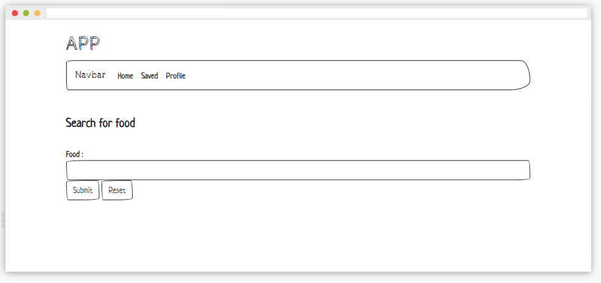

# Current Version - 1.0

[Live Site v.1](https://dev.gabrielroyce.com/Projects/Project1/index.html)

## API Project (Project 1)

> **Table of Contents**

&nbsp;&nbsp;&nbsp;&nbsp;&nbsp;&nbsp;[Home](../README.md)  
&nbsp;&nbsp;&nbsp;&nbsp;&nbsp;&nbsp;[Projects](../README.md)  
&nbsp;&nbsp;&nbsp;&nbsp;&nbsp;&nbsp;[Resume](../Resume/README.md)

---

> **Technologies Used:**

- Javascript
- HTML
- CSS
- JQuery

---

> **API Used:**

[Food And Grocery API](https://developer.edamam.com/food-database-api)

---

## Basic Project

&nbsp;&nbsp;&nbsp;&nbsp;&nbsp;&nbsp; - Allow for input of food items (ie. coffee and croissant)  
&nbsp;&nbsp;&nbsp;&nbsp;&nbsp;&nbsp; - Allow for input of serving sizes  
&nbsp;&nbsp;&nbsp;&nbsp;&nbsp;&nbsp; - Allow for multiple inputs to then be submitted at once  
&nbsp;&nbsp;&nbsp;&nbsp;&nbsp;&nbsp; - Return nutrient information

## Intended Changes

&nbsp;&nbsp;&nbsp;&nbsp;&nbsp;&nbsp; - Allow nutrition information to be saved  
&nbsp;&nbsp;&nbsp;&nbsp;&nbsp;&nbsp; - Provide mapping of daily / then weekly nutrition info  
&nbsp;&nbsp;&nbsp;&nbsp;&nbsp;&nbsp; - Calculate nutrition needs / excess and recommend changes based on current week  
&nbsp;&nbsp;&nbsp;&nbsp;&nbsp;&nbsp; - Include workout information or calories burned that day to offset nutrition info

---

## Stages:

&nbsp;&nbsp;&nbsp;&nbsp;&nbsp;&nbsp;**Stage 1:** Basic HTML/CSS Layout  
&nbsp;&nbsp;&nbsp;&nbsp;&nbsp;&nbsp;**Stage 2:** Connect JS/JQuery to HTML  
&nbsp;&nbsp;&nbsp;&nbsp;&nbsp;&nbsp;**Stage 3:** Add Search functionality/Connect to API  
&nbsp;&nbsp;&nbsp;&nbsp;&nbsp;&nbsp;**Stage 4:** Organize and display data  
&nbsp;&nbsp;&nbsp;&nbsp;&nbsp;&nbsp;**Stage 5:** Add 5 day forecast functionality  
&nbsp;&nbsp;&nbsp;&nbsp;&nbsp;&nbsp;**Stage 6:** Futher CSS design with scripted design (cards, animation, etc..)  
&nbsp;&nbsp;&nbsp;&nbsp;&nbsp;&nbsp;**Stage 7** Implement Info-saving with local storage  
&nbsp;&nbsp;&nbsp;&nbsp;&nbsp;&nbsp;**Stage 8:** Implement Further Calculation and functionality  
&nbsp;&nbsp;&nbsp;&nbsp;&nbsp;&nbsp;**TBD**

---

## Previous Versions

| #     | Date       |
| ----- | ---------- |
| 1.0.0 | 10/19/2022 |
| 1.0.1 | 10/22/2022

---

## Changes:

**v1.0.0** - Initalized  
**v1.0.1** - Added wireframes

---

## Known Issues:

&nbsp;&nbsp;&nbsp;&nbsp;&nbsp;&nbsp; - Everything

---

## Wireframe

